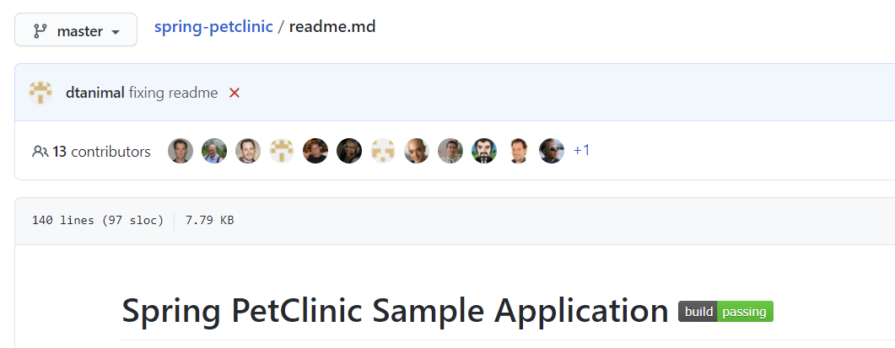

For this week, create a new SUBMISSION.md file in your repo. Add the images to a new figures
directory and add links to those images to the SUBMISSION.md file. The images you need are:

5 pts Your Github account showing that is has been forked from the depaulcdm/springpetclinic
repository.

5 pts Your Travis CI dashboard showing a successful first build.

5 pts The section of the POM file showing the coordinates after you’ve changed them.

5 pts Your Travis CI dashboard showing a successful build after your change of the group ID.

5 pts The section of the POM file showing the coordinates after you’ve commented them out.

5 pts Your Travis CI dashboard showing the unsuccessful build after the breaking change.

5 pts Your Github repository with the readme.md file selected showing the build failed status after the Travis CI build fails.

5 pts The section of the POM file showing the coordinates after you’ve fixed them.

5 pts Your Travis CI dashboard showing the successful build after the breaking change has been fixed.

5 pts Your Github repository with the readme.md file selected showing the build success status after the Travis CI build has recovered.

Submit a link to your repository in D2L. Make sure your Github repository is public.